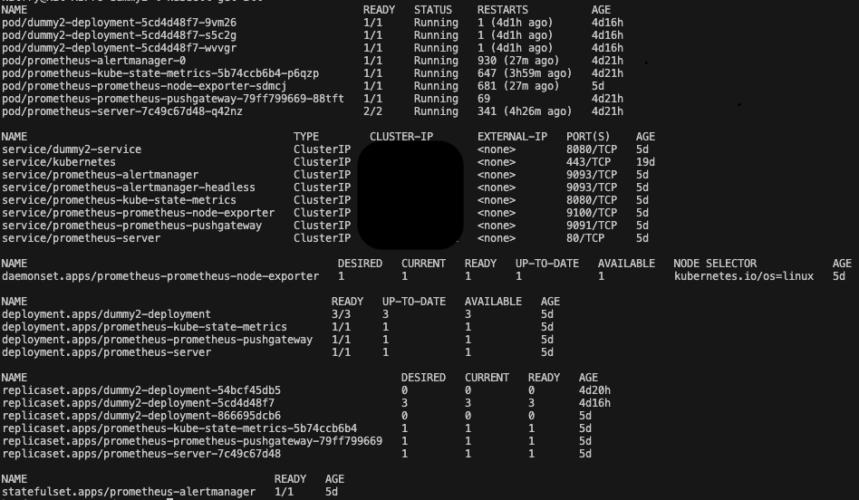

# fylakas

Fylakas is a Kubernetes cluster monitoring and visualization tool designed to provide helpful metrics and insight into the health of your cluster.

## Table of Contents

1. [Getting Started](#Getting-Started)
2. [Contributing](#Contributing)
3. [Progress](#Progress)
4. [Scripts](#Scripts)
5. [Our Team](#our-team)
6. [License](#license)

## Getting Started

Fylakas expects users to have a preconfigured Prometheus server deployed within their cluster in order to display metrics. If you'd like assistance with setting up a Kubernetes cluster or with deploying Kubernetes within that cluster, [this article](https://devopscube.com/setup-prometheus-monitoring-on-kubernetes/) is a great place to start.

1. **Connect To Your Cluster**: Ensure that both your application and your Prometheus server are deployed within your cluster by using the CLI command `kubectl get all`. The result should look something like this:
   
   If either Prometheus or your application are not deployed within the cluster, use the link above to determine how to deploy your application and / or Prometheus within your Kubernetes cluster.

2. **Connect Your Prometheus Server to Fylakas**: On the dashboard page, within the form labeled "CONNECT," input and submit the URL to your Prometheus Server. Under the hood, this will be initialized to a variable which tells our PromController where to send the queries for the metrics you want. The value of the server URL defaults to [http://localhost:9090](http://localhost:9090).

3. **See Your Data**: Once connected, your data should be visualized within the graphics on the dashboard page. Fylakas is configured to make a request to the Prometheus Server every 15 seconds. You can configure the interval that the Prometheus Server will scrape the data by locating or creating a `prometheus.yaml` file and assigning the desired `scrape_configs`. For example:

   scrape_configs:

   - job_name: 'example-job'
     static_configs:
     - targets: ['example.com:9090'] # Replace with your target's address and port
       scrape_interval: 10s # Set the scrape interval to 10 seconds
       scrape_timeout: 5s # Set the scrape timeout to 5 seconds

## Contributing

Fylakas is proud to be an Open Source Product. Contributions and additions to the product are not only permitted, but encouraged!

If you wish to contribute and / or be part of the team, please follow the following guidelines:

1. Fork and clone the repository
2. Branch off of the dev branch to create your own feature branch
   - The Feature branch name should start with feat, fix, bug, docs, test, wip, or merge (e.g. feat/database)
3. Commit your changes (git commit -m '(feat/bugfix/style/etc.): [commit message here]')
   - Please review [conventional commit](https://www.conventionalcommits.org/en/v1.0.0/) standards for more information
4. Once the feature is built and the commit is properly configured, submit a pull request to dev

## Progress

| Feature                        | Status |
| ------------------------------ | ------ |
| Cluster Data Visualization     | ✅     |
| Application Data Visualization | ⏳     |
| Customizable Visualization     | ⏳     |
| Predictive Visualization Tool  | 🙏🏻     |

- ✅ = Ready to use
- ⏳ = In progress
- 🙏🏻 = Looking for contributors

## Scripts

Below are descriptions of each npm script:

- `npm run build`: Starts the build mode
- `npm start`: Starts the production server using Nodemon
- `npm run dev`: Starts the development server using Nodemon
- `npm run test`: Runs tests with jest

## Our Team

Quinn Graves
[LinkedIn](https://www.linkedin.com/in/quinn-graves-84673028a/)
[GitHub](https://github.com/qpgdev)

Nathan Gonsalves
[LinkedIn](https://www.linkedin.com/in/iamkaprekar)
[GitHub](https://github.com/iAmKaprekar)

Katherine Fry
[LinkedIn](https://www.linkedin.com/in/katherine-fry-49071021b) 
[GitHub](https://github.com/KatFry)

Bogdana Oliynyk
[LinkedIn](https://www.linkedin.com/in/bogdanaoliynyk/)
[GitHub](https://github.com/Bogdana-Oliynyk)

Sebastian Salazar
[LinkedIn](https://www.linkedin.com/in/sebastian-salazar-526b75284/)
[GitHub](https://github.com/razalas340)

## License

By contributing, you agree that your contributions will be licensed under Fylakas' MIT License.
